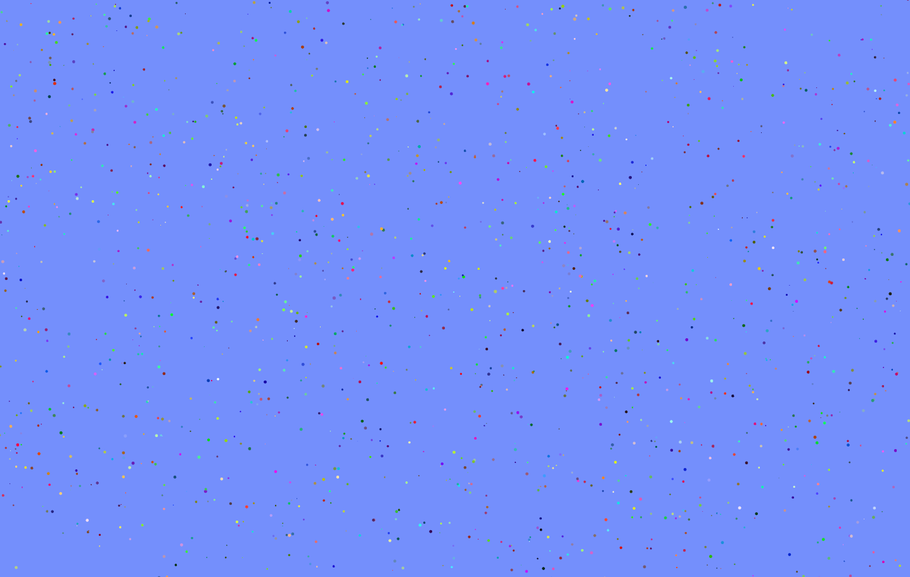
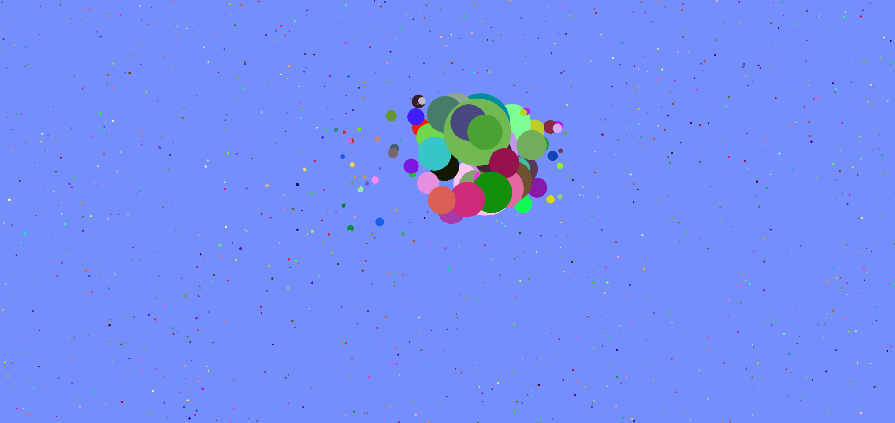
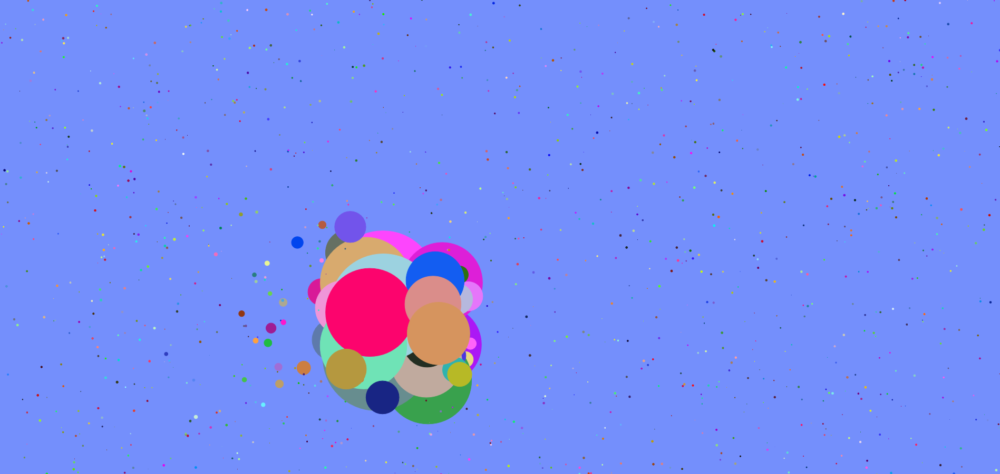

# PulseCanvas
🎨🔵🔃 Interactive art project with colorful bouncing circles created using HTML5 canvas. This project was designed as a learning experience, showcasing dynamic visual effects and mouse interactivity.  

In this project, I utilized the HTML5 canvas element to create an interactive art experience. The foundation of the project involved drawing and animating bouncing circles on the canvas. 
I implemented mouse interaction to dynamically change the size of the circles based on proximity. 
The colors of the circles were randomly generated using JavaScript. 
The project was developed as an opportunity for learning and experimentation with canvas animation techniques, interactivity, and JavaScript programming. 

if you want to test go to : [PulseCanvas](https://raanki.github.io/PulseCanvas/) 

## Picture :

## Without touching the mouse the page looks like this :
  

  
  
## if we moov
  

  

#### by @ranki
